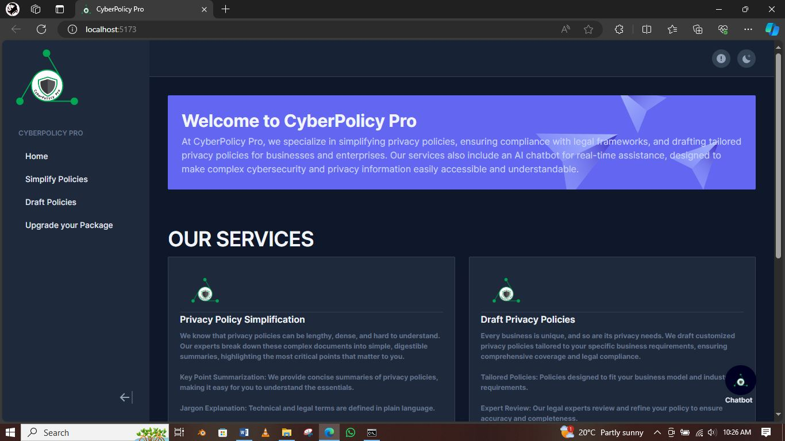
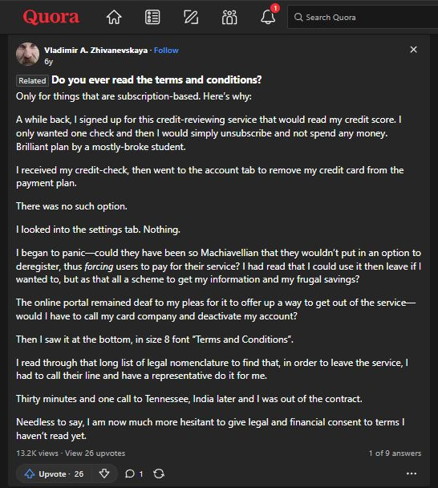

## Welcome to CyberPolicy Pro.



At CyberPolicy Pro, we specialize in simplifying existing privacy policies, ensuring compliance with legal frameworks, and drafting tailored privacy policies for businesses and enterprises. Our comprehensive services also include expert guidance and continuous updates to help you stay compliant and manage data privacy risks effectively.

## OUR SERVICES.

## Privacy Policy Simplification.

Privacy policies can be complex and difficult to understand. Our experts simplify these documents into clear, easy-to-understand summaries, highlighting the most critical points for users.

Simplify and Summarize: We translate complex legal jargon into plain language, providing concise summaries of privacy policies to help you grasp the essentials.

Jargon Explanation: Technical and legal terms are defined in simple terms.

Red Flag Identification: We highlight potentially concerning clauses that might impact your privacy and explain them clearly.

## Compliance Analysis.

Stay compliant with the latest legal frameworks and regulations. We offer thorough compliance checks to ensure your privacy policies meet industry standards and legal requirements.

Analyze for Compliance: We examine existing privacy policies against relevant legal frameworks (like GDPR, CCPA, etc.) to identify any potential compliance gaps.

Regular Updates: Stay up-to-date with the latest legal requirements and adjustments to ensure ongoing compliance.

Risk Assessment: Identify and mitigate potential compliance risks based on established frameworks like NIST SP 800-30.

## Tailored Privacy Policy Creation.

Every business has unique privacy needs. We draft customized privacy policies tailored to your specific business requirements, ensuring comprehensive coverage and legal compliance.

Craft User-Friendly Policies: We create comprehensive privacy policies that are written in clear, concise language, making them easy for users to understand.

Ensure Legal Compliance: We integrate necessary clauses and provisions to ensure compliance with relevant laws and regulations, tailored to your organization's specific needs.

Incorporate Best Practices: We recommend industry best practices for data security, transparency, and user control, ensuring your policy reflects current standards.

## Expert Guidance and Continuous Learning.

We provide ongoing support and expert advice to help you navigate complex privacy concepts and stay informed about emerging privacy laws and regulations.

Provide Explanations: We explain complex privacy concepts in a way that is easy to grasp, regardless of your technical background.

Offer Guidance and Recommendations: We offer guidance on how to improve your data privacy practices and address identified risks.

Stay Up-to-Date: We continually learn about emerging privacy laws and regulations to ensure our advice and analysis are accurate and relevant.

## Why Choose Us?

Expertise: Our team of privacy and legal experts brings a wealth of knowledge and experience to ensure you receive top-notch service.

Simplicity: We believe in making complex information simple and accessible, ensuring you stay informed and compliant without the headache.

Customer Focus: Your privacy and compliance needs are our top priority. We work closely with you to provide personalized, effective solutions.

### Problem Statement:
Many people specifically consumers/users do not pay keen attention to detail especially with privacy policies-mostof whom end up regretting on the decisions they made while signing up to company websites: Read this story from Quora https://www.quora.com/Is-there-a-website-or-resource-out-there-that-summarizes-and-makes-Terms-of-Service-and-Privacy-Policies-human-readable-accessible-and-useful



We could avoid such by providing consumers and businesses with a product that effectively delivers easily consumable information that is time-consuming anduser-friendly.

## Usage.

This project requires ``` node.js ``` and ``` npm ``` to run.

### Clone this Rpository.
```
git clone https://github.com/MrHackeric/CyberPolicy-Pro.git
```

### Go to project directory.
```
cd CyberPolicy-Pro.
```

### Project setup.
```
npm install.
```

#### Compiles and hot-reloads for development server.
The server runs on ``` localhost:5173 ```.
```
npm run dev.
```

### Go to API server directory and run the backend server.
```
cd src.
```
For server to run, create a ```.env``` file with Google's Gemini API Key and store it in the ```.env``` file under the variable name API_KEY. Get API Key here https://aistudio.google.com/app/apikey.

The server listens on ```localhost:3000```.

Run ```node server.js``` to deploy server.

#### Compiles and minifies for production.
```
npm run build.
```

#### Customize configuration.
See [Configuration Reference](https://vitejs.dev/guide/).
